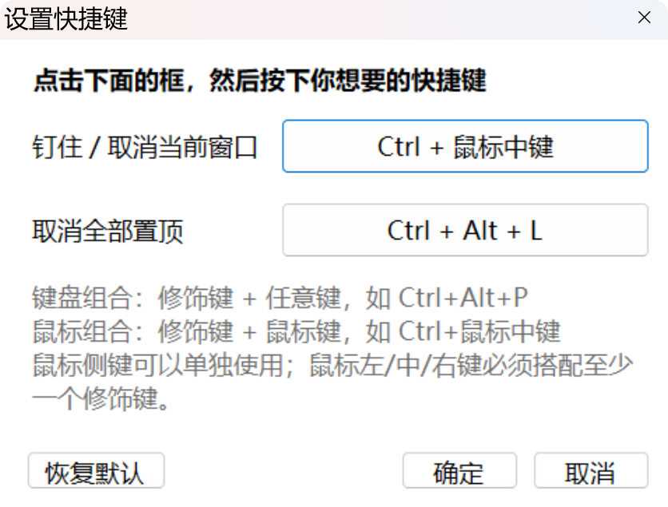

# AlwaysOnTop

> 📌 一个只做一件事的 Windows 窗口置顶小工具 —— 按一下快捷键，当前窗口就钉在最前。


<br/>
<hr/>
<div align="center">

<h3>中文</h3>

# 目录

</div>

- [使用说明](#使用说明)
- [快捷键](#快捷键)
- [特色功能](#特色功能)
- [安装指南](#安装指南)
- [从源码构建](#从源码构建)
- [实现要点](#实现要点)
- [已知限制](#已知限制)
- [致谢](#致谢)
- [License](#license)

<div align="center">

# 使用说明

</div>

| 操作               | 说明                                                                     |
| ------------------ | ------------------------------------------------------------------------ |
| **钉住 / 取消**    | 默认 `Ctrl + 鼠标中键`。当前窗口即被钉在最前，再按一次取消                |
| **取消全部置顶**   | 默认 `Ctrl + Alt + L`。一次把所有被钉住的窗口放下来                       |
| **改快捷键**       | 托盘图标右键 →「设置快捷键…」，点一下候选框，再按下你想要的组合            |
| **托盘菜单**       | 「钉住 / 取消当前窗口」「取消全部置顶」「设置快捷键…」「退出」              |

被钉住的窗口上**不显示任何标记** —— 靠它一直压在最前就能看出来。想取消时把鼠标指向那个窗口，再按一次快捷键；或者用托盘图标的「取消全部置顶」。

<div align="center">

# 快捷键

</div>

两个快捷键都可以改：**托盘图标右键 →「设置快捷键…」**，点一下候选框，然后直接按下你想要的组合即可。

| 功能               | 默认值            |
| ------------------ | ----------------- |
| 钉住 / 取消当前窗口 | `Ctrl + 鼠标中键` |
| 取消全部置顶        | `Ctrl + Alt + L`  |



- **键盘组合** —— 修饰键 + 任意键，例如 `Ctrl+Alt+P`
- **鼠标组合** —— 修饰键 + 鼠标键，例如 `Ctrl+鼠标中键`、`Alt+鼠标右键`
- **鼠标侧键** —— `鼠标侧键1` / `鼠标侧键2` 可以单独使用，不必搭配修饰键
- 鼠标左 / 中 / 右键**必须搭配至少一个修饰键**，否则会干扰正常点击，设置窗口会拦下来
- 两个快捷键不能设成同一个组合；键盘组合如果已被别的程序占用，会提示并让你换一个

也可以直接编辑配置文件 `%APPDATA%\AlwaysOnTop\config.txt`（**改完需要重启程序**）：

```
hotkey=Ctrl+鼠标中键
unpinall=Ctrl+Alt+L
```

命令行加 `--settings` 可以直接打开设置窗口，方便把它钉成快捷方式：

```bat
AlwaysOnTop.exe --settings
```

<div align="center">

# 特色功能

</div>

- [x] 两个快捷键都完全可自定义，键盘组合和鼠标组合都支持
- [x] 支持同时钉住多个窗口
- [x] 不往目标窗口上绘制任何东西，零干扰
- [x] 单文件可执行程序，无安装程序、不写注册表、不装服务
- [x] 退出时自动取消所有置顶，不会留下没法取消的置顶窗口

<div align="center">

# 安装指南

</div>

没有任何安装程序，解压即用：

1. 下载 [AlwaysOnTop.exe](https://github.com/bor62623-dot/Always-on-top/releases)（或自己编译，见下一节）
2. 放到任意目录，双击运行。程序没有主窗口，只在系统托盘显示一个图标
3. 需要开机自启的话，把它的快捷方式放进启动文件夹：

   <kbd>Win</kbd> + <kbd>R</kbd> 输入 `shell:startup` 回车，把快捷方式拖进去即可

**卸载**：托盘图标右键 → 退出，然后删掉 exe。没有残留。

**系统要求**：Windows 10 / 11，需要 .NET Framework 4.8（Windows 10 1903 及以后自带）。

<div align="center">

# 从源码构建

</div>

只依赖 .NET Framework 自带的 C# 编译器，不需要装 Visual Studio 或 .NET SDK：

```bat
build.cmd
```

编译产物为根目录下的 `AlwaysOnTop.exe`。

<details>
<summary>手动编译</summary>

```bat
%WINDIR%\Microsoft.NET\Framework64\v4.0.30319\csc.exe ^
  -nologo -target:winexe -out:AlwaysOnTop.exe ^
  -r:System.dll -r:System.Windows.Forms.dll -r:System.Drawing.dll ^
  src\AlwaysOnTop.cs
```

</details>

<div align="center">

# 实现要点

</div>

**全局鼠标钩子而非 `RegisterHotKey`**
`RegisterHotKey` 只支持键盘，不支持鼠标键。快捷键一旦涉及鼠标，就必须用 `SetWindowsHookEx(WH_MOUSE_LL)` 低级鼠标钩子。钩子只拦截设定的那一个组合并吞掉它的事件，其余鼠标事件原样放行 —— 所以**纯中键**在浏览器、截图工具里的一切原有功能都不受影响。

**快捷键捕获**
设置窗口里点一下候选框即进入捕获模式：键盘走 `ProcessCmdKey`（普通 `KeyDown` 抓不到 Tab、方向键这类会被控件吃掉的键），鼠标走候选框自己的 `MouseDown`。捕获期间必须让全局鼠标钩子**完全放行** —— 否则用户想设的组合会被钩子自己吞掉，永远捕获不到。

**为什么最后没有做视觉标记**
早期版本做过两版标记：给被钉窗口描一圈圆角蓝边，以及在标题栏放一个蓝色图钉（可点击取消、可拖动、位置按程序记住）。都去掉了，原因如下。

功能的实现没问题，瓶颈在**定位**：Windows 没有可靠的接口能告诉你「另一个程序的标题栏按钮在哪」。实测 `DWMWA_CAPTION_BUTTON_BOUNDS`，对最大化窗口返回完全正确的坐标，对非最大化窗口返回与窗口毫无关系的值（一个 `1038,697 - 1843,1222` 的窗口被报成 `167,0 - 447,56`），对 Electron 这类自定义标题栏的应用直接返回宽度 0。正因为按钮位置是各个程序自己画的，先后试的三套推算方案（信接口坐标 / 只信接口尺寸再换算 / 用系统固定常量推算）每套都只能覆盖一部分窗口，剩下的一放就压到最小化按钮上。

最后的折中方案是让用户自己拖 —— 这确实能用，但为此要引入拖动、点击与拖动的区分、位置持久化、跨机器兼容（偏移是像素值，缩放比不同就偏）等一整套复杂度。而它换来的只是一句「这个窗口被钉住了」的提示，**性价比不成立**，所以整个删掉。

<div align="center">

# 已知限制

</div>

- 仅支持 Windows 10 / 11
- 没有视觉标记，钉住状态只能靠窗口一直压在最前来判断
- 如果选的组合恰好被别的程序占用，键盘组合会注册失败并弹提示；鼠标组合则会被本工具抢走，这时换一个组合即可
- 内存占用约 30 MB，是 .NET Framework WinForms 的固定基线

<div align="center">

# 致谢

</div>

| 来源 | 借了什么 |
| --- | --- |
| [Pot](https://github.com/pot-app/pot-desktop) | README 的排版结构；设置窗口里「点一下候选框、再按下组合键」的交互方式 |
| [PowerToys](https://github.com/microsoft/PowerToys) | Always On Top 的产物标准。本项目正是嫌它太重（安装 1 GB 量级、常驻几百 MB）才写的 |

代码上没有复用任何一行 —— Pot 是 Tauri（Rust + WebView），本项目是 C# WinForms + Win32 API，技术栈没有交集。

<div align="center">

# License

</div>

[MIT](LICENSE)
